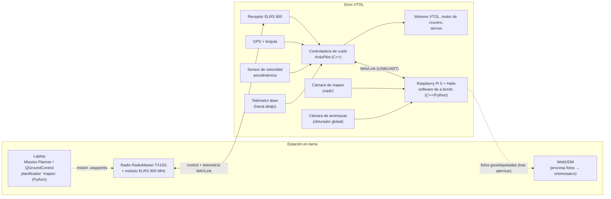
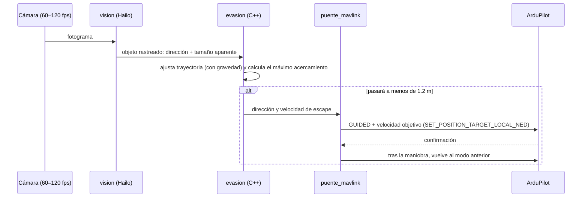

# 02 · Arquitectura del sistema

## Vista general



## Responsabilidades

### Controladora de vuelo (ArduPilot, modo QuadPlane)
- Estabilización, transición hover ↔ avión, navegación por waypoints.
- Seguimiento del terreno con datos SRTM (`TERRAIN_ENABLE=1`).
- Disparo de la cámara por distancia (`DO_SET_CAM_TRIGG_DIST`), que se envía por MAVLink a la Raspberry Pi.
- Seguridad: retorno automático (RTL) si se pierde la radio o baja la batería, geocerca.
- **Tiene siempre la última palabra.** Si la Raspberry Pi falla o se cuelga, el avión sigue volando su misión.

### Computadora de a bordo (Raspberry Pi 5 + acelerador Hailo)
Procesos independientes, para que un fallo en uno no afecte a los demás:

| Proceso | Lenguaje | Función | Estado |
|---|---|---|---|
| `evasion` | C++ | Estima la trayectoria de objetos que se acercan y decide la maniobra | **Hecho** (`companion/`) |
| `percepcion` + `supervisor` | C++ | Convierte detecciones en píxeles en amenazas NED, rastrea y decide cuándo tomar y soltar el control | **Hecho** (`companion/`), probado con enlace simulado |
| `vision` | C++ + HailoRT | Captura de cámara e inferencia YOLO; entrega `Deteccion` a `percepcion` | Fase 6 |
| `puente_mavlink` | C++ (MAVSDK) | Implementa `EnlaceVuelo`: modo, velocidad y actitud de ArduPilot | Fase 6 |
| `captura` | Python | Toma la foto de mapeo cuando ArduPilot lo ordena y guarda posición/actitud | Fase 5 |
| `registro` | Python | Guarda todo para analizar los vuelos | Fase 5 |

### Estación en tierra
- **Mission Planner** (Windows) o **QGroundControl** (Windows/Mac/Linux/Android): configuración, carga de misiones y monitoreo.
- **`mapeo`** (este repositorio): genera misiones de fotogrametría optimizadas para ala fija, con seguimiento del terreno.
- **WebODM**: une las fotos en ortomosaico, modelo digital de superficie y nube de puntos.

## Cómo se evita una piedra (flujo de datos)



Presupuesto de tiempo: cámara (~10–16 ms) + inferencia (~15–25 ms) + enlace MAVLink (~10 ms) + respuesta del dron (~150–300 ms). Una piedra a 20 m/s detectada a 15 m llega en ~0.75 s, así que hay margen; detectada a 6 m ya no lo hay. Detalles en [10](10-ia-y-evasion.md).

## Marcos de referencia
Todo el núcleo de evasión trabaja en **NED** (norte, este, abajo) centrado en el dron, ya compensado por la actitud. El proceso `vision` convierte los píxeles de la cámara a una dirección NED usando la actitud que publica ArduPilot (mensaje `ATTITUDE`).

## Repositorio

```
Dron/
├── docs/                    documentación paso a paso
├── herramientas/mapeo/      planificador de misiones de fotogrametría (Python, sin dependencias)
├── companion/               software de a bordo (C++17, CMake)
│   ├── include/evasion/     núcleo de evasión: evaluador de amenazas, planificador, simulador
│   ├── src/
│   └── pruebas/
└── firmware/ardupilot/      parámetros y lista de verificación de ArduPilot
```
