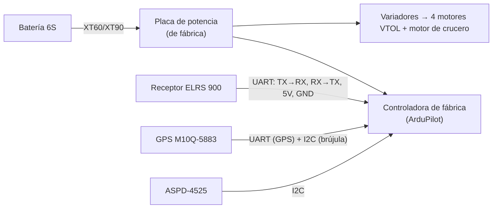
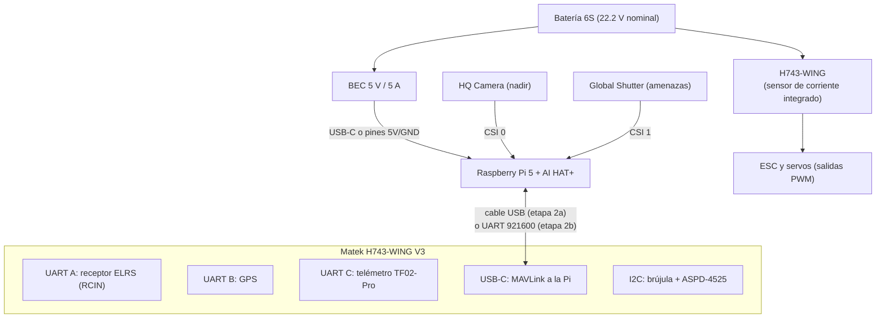

# 06 · Planos de integración y cableado

> Los números de puerto (`SERIALn`) dependen de la controladora. Antes de soldar, abre la página de tu placa en la [lista de controladoras de ArduPilot](https://ardupilot.org/plane/docs/common-autopilots.html) y anota qué pad corresponde a cada `SERIALn`.

## Etapa 1 · Avión de fábrica (casi sin soldar)

El T2 Cruza VTOL PNP con controladora viene cableado y afinado de fábrica. Tú solo conectas:



Configuración en ArduPilot del puerto del receptor: `SERIALn_PROTOCOL = 23` (RCIN) y `RSSI_TYPE = 3`. Guía oficial: [Crossfire y ELRS en ArduPilot](https://ardupilot.org/plane/docs/common-tbs-rc.html) y [opciones de puertos serie](https://ardupilot.org/plane/docs/common-serial-options.html).

## Etapa 2 · Controladora Matek H743-WING V3 + computadora de a bordo



### Tabla de conexiones

| Desde | Hacia | Cables | Configuración ArduPilot |
|---|---|---|---|
| Receptor ELRS: TX, RX, 5V, GND | UART A de la H743 | TX→RX, RX→TX (cruzados) | `SERIALn_PROTOCOL=23` |
| GPS M10Q: TX, RX, 5V, GND | UART B | cruzados | `SERIALn_PROTOCOL=5` (GPS) |
| GPS M10Q: SDA, SCL | I2C de la H743 | directo | la brújula se detecta sola |
| ASPD-4525: SDA, SCL, 5V, GND | I2C (en paralelo con la brújula) | directo | `ARSPD_TYPE` = MS4525 |
| TF02-Pro: TX, RX, 5V, GND | UART C | cruzados | `SERIALn_PROTOCOL=9` (telémetro), `RNGFND1_TYPE` = Benewake |
| Pi 5 (USB-A) | H743 (USB-C) | cable USB corto | MAVLink por `SERIAL0` (sin configurar) |
| *Alternativa:* Pi 5 GPIO14 (pin 8, TX), GPIO15 (pin 10, RX), GND (pin 6) | UART libre de la H743 | cruzados, solo 3.3 V | `SERIALn_PROTOCOL=2` (MAVLink2), `SERIALn_BAUD=921` |
| BEC 5 V | Pi 5 | USB-C o pines 2 (5V) y 6 (GND) | Si se alimenta por pines, agregar `usb_max_current_enable=1` en `config.txt` |

> **Empieza por USB** entre la Pi y la controladora: no requiere soldar y es suficiente para MAVLink. Pasa a UART cuando quieras liberar el USB para configurar en el campo.

## Distribución en el fuselaje (vista superior)

```
              ← sentido de vuelo
  ┌─────────────────────────────────────────────────┐
  │  [GPS]                                          │  ← GPS arriba y lejos de cables de potencia
  │   (nariz)  [Cámara de amenazas → mirando adelante/abajo 30°]
  │                                                 │
  │  [Batería 6S]  ← se desliza para ajustar el CG  │
  │                                                 │
  │  [Controladora]  [Raspberry Pi 5 + Hailo]       │  ← sobre amortiguadores de goma
  │                       [Cámara nadir ↓]          │  ← agujero en el fondo, cerca del CG
  │  [BEC]        [Receptor: antenas en V, fuera]   │
  │                       [Telémetro ↓]             │
  └─────────────────────────────────────────────────┘
```

Reglas de montaje:
1. **Centro de gravedad (CG):** el fabricante indica dónde debe quedar (marca bajo el ala). Pon el avión completo, con batería, sobre dos dedos en esa marca: debe quedar horizontal o con la nariz levemente abajo. **Nunca vueles con la cola pesada.**
2. **Cámara nadir:** cerca del CG, mirando exactamente hacia abajo, con el lado largo del sensor perpendicular al vuelo (así lo asume `mapeo`). Monta sobre goma para filtrar vibraciones.
3. **Antenas del receptor:** fuera de la fibra de carbono y de los cables de potencia, en "V" a 90°.
4. **GPS:** lo más lejos posible del BEC, la Pi y los cables de batería (generan interferencia).
5. **Ventilación:** la Pi 5 con Hailo genera 8–12 W de calor. Deja una entrada y una salida de aire.

## Placa de montaje de la Raspberry Pi

Como no tienes impresora 3D, usa una placa de **fibra de vidrio (FR4) o acrílico de 2 mm** cortada a mano, o pide la pieza a un servicio de impresión 3D local:

```
   ┌──────────── 100 mm ────────────┐
   │  o                          o  │   o = agujeros M2.5 para la Pi 5
   │   ←──────── 58 mm ────────→    │       (patrón de 58 × 49 mm)
   │                                │ 70 mm
   │  o                          o  │
   │  ↑ 49 mm                       │
   │  [ranuras para velcro/bridas]  │
   └────────────────────────────────┘
```

Separadores de nylon M2.5 de 11 mm entre la Pi 5 y el AI HAT+.

## Presupuesto de energía

| Consumidor | Potencia típica |
|---|---|
| Crucero (motor delantero) | 150–250 W |
| Hover (4 motores VTOL), solo despegue y aterrizaje | 900–1 400 W |
| Raspberry Pi 5 + Hailo + 2 cámaras | 8–12 W |
| Controladora, GPS, receptor, telémetro | ~3 W |

La electrónica de a bordo (12 W) es ~8 % de la potencia de crucero: le resta unos 3–4 minutos de autonomía.
