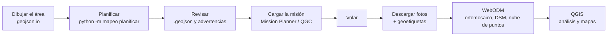

# 09 · Mapeo y procesamiento

## Flujo de trabajo



## 1. Dibujar el área
1. Abre [geojson.io](https://geojson.io), busca la zona y dibuja un polígono.
2. Guárdalo con *Save → GeoJSON* (por ejemplo `mi_area.geojson`).

## 2. Planificar la misión

En Windows (PowerShell) usa `py` en lugar de `python3` y pon las coordenadas **entre comillas**: `--despegue "-0.5300,-78.5800"`.

```bash
cd herramientas/mapeo
python3 -m mapeo camaras                     # cámaras disponibles
python3 -m mapeo gsd --gsd 3                 # ¿a qué altura obtengo 3 cm/píxel?
python3 -m mapeo planificar \
  --area mi_area.geojson \
  --despegue -0.5300,-78.5800 \
  --gsd 3 --terreno --autonomia 45 \
  --salida mi_mision.waypoints
```

Salida de ejemplo (área de 187 ha):

```
Área:                187.3 ha
Altitud / GSD:       116 m / 3.00 cm/píxel
Rumbo de líneas:     84°  (28 líneas)
Espaciado líneas:    42.6 m
Foto cada:           22.8 m
Fotos estimadas:     1970
Distancia total:     50.29 km
Tiempo estimado:     64.9 min
ADVERTENCIA: La misión dura ~65 min y deja menos del 20 % de reserva ... divida el área en varios vuelos.
```

Abre `mi_mision.geojson` en geojson.io para ver las líneas sobre el mapa antes de volar.

### Parámetros recomendados

| Situación | Traslape frontal / lateral | Notas |
|---|---|---|
| Terreno abierto, construcciones | 75 % / 65 % (por defecto) | |
| Vegetación densa, bosque | 80 % / 70 % | La vegetación se mueve y tiene poca textura |
| Con viento > 5 m/s | — | Use `--rumbo` para que las líneas queden **perpendiculares al viento**: la velocidad sobre el suelo es igual en todas las pasadas |
| Zona montañosa | — | **Siempre `--terreno`**: la altitud se mide sobre el terreno, no sobre el punto de despegue. Cada subida del relieve cuesta energía: deja más reserva. Revisa la geocerca de altura (ver [firmware](../firmware/ardupilot/README.md)) |
| Zona plana | — | `--terreno` sigue siendo seguro y es lo recomendable si hay cualquier desnivel; en terreno realmente plano la altitud relativa al despegue basta |
| Área para ~1 h de vuelo | — | ≈ 170 ha a 3 cm/píxel. Use `--autonomia <min medidos>` para que el programa avise si no cabe ([11](11-autonomia-1-hora.md)) |

## 3. Cargar y revisar en Mission Planner
1. Pestaña **Plan** → *Load WP File* → elige el `.waypoints`.
2. Comprueba que los waypoints con marco **Terrain** muestren altitudes coherentes (Mission Planner descarga el relieve SRTM).
3. *Write WPs* para enviarla al avión.

## 4. Configuración de la cámara
- Enfoque fijo a infinito.
- Velocidad de obturación rápida: `mapeo gsd` indica la exposición máxima para no tener desenfoque por movimiento (por ejemplo 1/1 200 s a 16 m/s y 100 m).
- ISO lo más bajo posible que permita esa velocidad.
- Balance de blancos fijo (no automático), para que las fotos tengan colores parecidos.

## 5. Procesar con WebODM
[WebODM](https://github.com/OpenDroneMap/WebODM) es libre y corre en Docker:

```bash
git clone https://github.com/OpenDroneMap/WebODM --config core.autocrlf=input --depth 1
cd WebODM
./webodm.sh start
# abre http://localhost:8000
```

Sube las fotos (y el archivo de puntos de control, si lo tienes) y usa el perfil *Default* o *High Resolution*. Como la Pi Camera tiene obturador rodante, activa la opción **rolling-shutter** en las opciones avanzadas.

Productos: ortomosaico (GeoTIFF), modelo digital de superficie (DSM), modelo digital del terreno (DTM), nube de puntos y modelo 3D texturizado.

## 6. Precisión: puntos de control en tierra
Sin RTK, el GPS da una precisión absoluta de 2–5 m. Para mejorarla:
- Coloca **5 o más marcas** (por ejemplo, cruces de 60 × 60 cm en blanco y negro) repartidas por el área, incluidas las esquinas.
- Mide sus coordenadas con un GNSS preciso (o con un GPS de buena calidad promediando varios minutos).
- En zonas inseguras donde no se puede entrar, usa **puntos naturales** identificables en imágenes satelitales o mapas oficiales del IGM.
